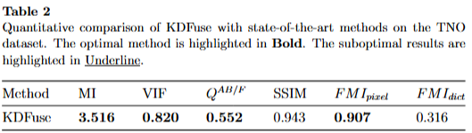
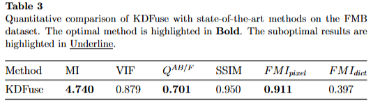
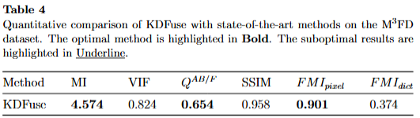

# KDFuse
This is official Pytorch implementation of "KDFuse: A High-Level Vision Task-driven Infrared and Visible Image Fusion Method Based on Cross-Domain Knowledge Distillation".  

We have optimized the code, and the latest version along with the results are as follows:

  

  

  

  

# Framework
The overall framework of the proposed KDFuse.

# To Train
1. Download the checkpoint from [seg_model](https://pan.baidu.com/s/1J_XiTRoZbSJ38Qxw2hVrYg?pwd=1wfb) and put it into `'./pretrained/'`.
2. run 'train.py'

# To Test
1. Download the checkpoint from [fusion_model](https://pan.baidu.com/s/1HAFM9ms8vsh8i1lbzPXpMQ?pwd=fhqf) and put it into `'./models/'`.
2. Place the paired test images in the folder `'./image/'.`
3. The result data_root are put in `'./Results/'`.
   
Then run `test.py`.
